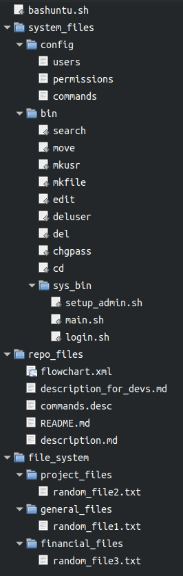

# Dev Notes

Here I've made some notes for you guys regarding the new (and hopefully final) file structure, and the overall flow of how this whole thing is (supposed to) operate. Hopefully this screenshot of the file tree will make it more obvious, since I know it's hard to get a picture in your head of the overall file structure from the terminal.

The top level (in this case, left-most level) is the root-level of the git repo. So in that directory, we have just:

* file_system
* repo_files
* system_files
* bashuntu
* .git
* .vscode

we can ignore .git, .vscode, and repo_files because they aren't part of the "shell" that we're making for this. Everything else, though, is relavent and matters. One thing I couldn't show in this screencap for reasons too complicated to bother explaining, I wasn't able to include the "meta" files I've added. These meta-files are there specifically to contain the permissions and rules for each user group and what they are and aren't allowed to do. I'll use an example to demonstrate.